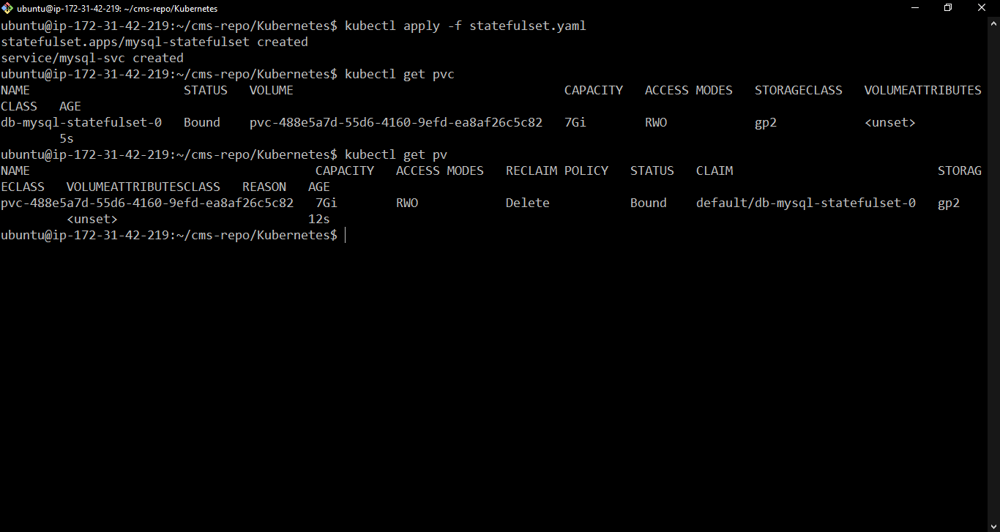
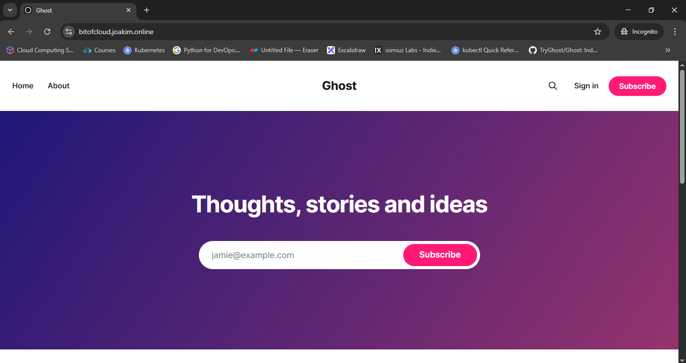

## Deploying Application into EKS cluster

### 1. Launch EC2

- ```bash
    Launch an EC2 instance which will be used as dev machine to create cluster manage Kubernetes cluster. Connect via SSH.
    ```

### 2. Creating EKS cluster for application deployment
#### 2.1 Install and configure AWS CLI
- Install
    ```bash
    curl "https://awscli.amazonaws.com/awscli-exe-linux-x86_64.zip" -o "awscliv2.zip"

    curl -o awscliv2.sig https://awscli.amazonaws.com/awscli-exe-linux-x86_64.zip.sig

    unzip awscliv2.zip

    sudo ./aws/install -i /usr/local/aws-cli -b /usr/local/bin

    # Confirm installation by running
    aws --version
    ```
- Configure aws cli
     ```bash
    aws configure 
    # provide AWS Access key ID, AWS Secret Acccess key ID, default region and output format.

    # confirm installaation by running
    aws s3 ls
    ```

#### 2.2 Install kubectl and eksctl
- Install eksctl: Tool used to create EKS cluster
    ```bash
    # for ARM systems, set ARCH to: `arm64`, `armv6` or `armv7`
    ARCH=amd64
    PLATFORM=$(uname -s)_$ARCH

    curl -sLO "https://github.com/eksctl-io/eksctl/releases/latest/download/eksctl_$PLATFORM.tar.gz"

    # (Optional) Verify checksum
    curl -sL "https://github.com/eksctl-io/eksctl/releases/latest/download/eksctl_checksums.txt" | grep $PLATFORM | sha256sum --check

    tar -xzf eksctl_$PLATFORM.tar.gz -C /tmp && rm eksctl_$PLATFORM.tar.gz

    sudo mv /tmp/eksctl /usr/local/bin
    ```

- Install kubectl: Kubernetes Client
    ```bash
    curl -LO "https://dl.k8s.io/release/$(curl -L -s https://dl.k8s.io/release/stable.txt)/bin/linux/amd64/kubectl"

    curl -LO "https://dl.k8s.io/release/$(curl -L -s https://dl.k8s.io/release/stable.txt)/bin/linux/amd64/kubectl.sha256"

    echo "$(cat kubectl.sha256)  kubectl" | sha256sum --check

    sudo install -o root -g root -m 0755 kubectl /usr/local/bin/kubectl

    kubectl version --client # check installation

    ```

#### 2.3 Create EKS cluster
- create cluster
    ```bash
    eksctl create cluster --name=ghost-cms-ks \
                      --region=ap-south-1 \
                      --zones=ap-south-1a,ap-south-1b \
                      --without-nodegroup 
    ```
    
- create nodegroup and add nodes
    ```bash
    eksctl create nodegroup --cluster=ghost-cms-ks \
                        --region=ap-south-1 \
                        --name=node-grp-1 \
                        --node-type=t2.medium \
                        --nodes-min=2 \
                        --nodes-max=3 \
                        --node-volume-size=20 \
                        --managed \
                        --asg-access \
                        --external-dns-access \
                        --full-ecr-access \
                        --appmesh-access \
                        --alb-ingress-access \
                        --node-private-networking
    ```
    
- Check 
    ```bash
    kubectl get nodes
    ```
   
#### [2.4 Install aws-ebs-csi-driver for Creating EBS as external volume](https://docs.aws.amazon.com/eks/latest/userguide/ebs-csi.html#awscli_store_app_data)
- ```bash
    aws eks describe-addon-versions --addon-name aws-ebs-csi-driver
    ```

- Associate oidc provider 
    ```bash
    eksctl utils associate-iam-oidc-provider \
            --region=ap-south-1 \
            --cluster=ghost-cms-ks \
            --approve
    ``` 
- Step 1: Create an IAM role

    ```bash
    eksctl create iamserviceaccount \
        --name ebs-csi-controller-sa \
        --namespace kube-system \
        --cluster ghost-cms-ks \
        --role-name ghost-ebs-csi-role \
        --attach-policy-arn arn:aws:iam::aws:policy/service-role/AmazonEBSCSIDriverPolicy \
        --approve
    ```
    ✅ Make sure you wait for this role creation to complete before proceeding.
    

- get ARN of IAM Role
    ```bash
    ARN=$(aws iam get-role --role-name ghost-ebs-csi-role  --query 'Role.Arn' --output text)
    ```

- Deploy EBS CSI Driver (Add-on)
    ```bash
    eksctl create addon --cluster ghost-cms-ks --name aws-ebs-csi-driver --version latest \
    --service-account-role-arn $ARN --force
    ```
    ✅ This installs the CSI driver as an EKS-managed add-on
    

- Verify the Add-on Installation
    ```bash
    eksctl get addon --cluster ghost-cms-ks
    ```
    see `aws-ebs-csi-driver` listed with a `STATUS: ACTIVE`

### 3. Let's Use Secure secrets with [sealed-secrets](https://github.com/bitnami-labs/sealed-secrets)
In Kubernetes secret objects, data is not encrypted but it is base64 encoded, and so we cannot push our secret manifest to git.

#### Introduction to sealed-secrets
"Encrypt your Secret into a SealedSecret, which is safe to store - even inside a public repository."
We'll install a cluster-side controller and A client-side utility (kubeseal).
The kubeseal utility uses asymmetric crypto to encrypt secrets that only the controller (running in your cluster) can decrypt.
, and this is how it is safe to commit secrets.

#### [Installation Instructions](https://github.com/bitnami-labs/sealed-secrets/releases)
- #### Cluster-side
    Install the SealedSecret CRD and server-side controller into the kube-system namespace:
    ```bash
    kubectl apply -f https://github.com/bitnami-labs/sealed-secrets/releases/download/v0.29.0/controller.yaml
    ```
- #### Client-side
    Install the client-side tool into /usr/local/bin/:
    ```bash
    curl -OL "https://github.com/bitnami-labs/sealed-secrets/releases/download/v0.29.0/kubeseal-0.29.0-linux-amd64.tar.gz"
    tar -xvzf kubeseal-0.29.0-linux-amd64.tar.gz kubeseal
    sudo install -m 755 kubeseal /usr/local/bin/kubeseal
    ```
#### Let's Secure our secrets
- Create Sealed secret for our secretes
    ```bash
    # add your credetials in secret object first
    kubeseal -o yaml < db_secret.yaml > sealed_db_secret.yaml
    kubeseal -o yaml < mail_secret.yaml > sealed_mail_secret.yaml
    ```

 🚨 **Critical:** we have `sealed_db_secret.yaml` and `sealed_mail_secret.yaml` we need to commit these to git. (Commit only Sealed Secrets, Don't commit Secret Manifest)


- But how are we going to get secret in K8s cluster
    ```bash
    # apply 
    kubectl apply -f sealed_db_secret.yaml
    kubectl apply -f sealed_mail_secret.yaml

    # kubectl get secrets
    ```
    
**Note** When we apply these manifest to our cluster, Operator running in cluster will decrypt it and it will create secret object.

### 4. Deploy Application
#### 4.1 Create ConfigMap
- apply the manifest files
    ```bash
    kubectl apply -f configmap_ghost.yaml
    ```

#### 4.2 Deploy Database
- Create storage class 
    ```bash
    kubectl apply -f storageClass.yaml
    # if storage class already present make sure that `ReclaimPolicy: Retain`
    # It will prevent deletion of PV and Storage resource to get delete if PVC is deleted.
    ```
- Deploy MySQL
    ```bash
    kubectl apply -f statefulset.yaml
    ```

- Check PVC, PV and EBS
    - It will create PVC from `volumeClaimTemplates:` and it will create a PV and EBS volume.
        


#### 4.3 Deploy Application and app-service 
- Deploy Ghost CMS
    ```bash
    kubectl apply -f pvc.yaml

    kubectl apply -f deployment.yaml

    kubectl apply -f service.yaml
    ```
- It will create EBS volume for Database and ghost (7 and 10 GB as specified in PVC or claim template)
    
### 5. Cert Manager
- Install Cert Manager 
    ```bash
    kubectl apply -f https://github.com/cert-manager/cert-manager/releases/download/v1.14.5/cert-manager.yaml
    ```
- Create Cluster Issuer
    ```bash
    kubectl apply -f cluster_issuer.yaml
    ```
- Apply the Certificate Resource
  ```bash
  kubectl apply -f certificate

  # wait for it to be ready
  kubectl get certificate

  # NAME   READY   SECRET   AGE
  # app    True    app      20s
  
  ```


### 6. Ingress for external Traffic
- Install Nginx Ingress Controller
    ```bash
    kubectl apply -f https://raw.githubusercontent.com/kubernetes/ingress-nginx/controller-v1.9.4/deploy/static/provider/cloud/deploy.yaml

    kubectl get svc -n ingress-nginx

    # It will create a LoadBlancer
    # Add a CNAME record in your domain registrar portal redirecting to DNS name of LoadBalancer
    ```
     
    
- Create Certificate
    ```bash
    kubectl apply -f certificate

    # run kubectl get certificate and wait for it to be true
    ```
    
- Apply Ingress Resource Manifest
    ```
    kubectl apply -f ingress.yaml
    ```
### 7. Access Ghost
- Type your URL in browser and access ghost, Login and configure.
    


🏡[Homepage](../README.md)
