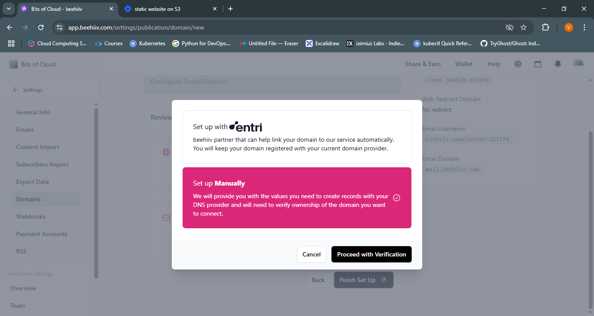

# ✨ Beehiiv Exploration and Tutorial

---

## 🚀 Getting Started 

### 1. ✍️ SignUp
- Create a free account at [beehiiv](https://www.beehiiv.com), You will land in welcome page.
    
- Start a beehiiv publication, give it a name, logo and default header image and fill if anything else is asked and Finish your publication settings.
- Complete you profile by navigating to profile section.
    
- Optionally Explore the website builder and Discover the editor.

---

### 2. 📬 Subscribe
- Open you site from another browser and subscribe from your another email.
- All your subscribers can be seen in [Subscribers](https://app.beehiiv.com/subscribers)
    

---

### 3. 📝 Publish Your First Blog 
- Navigate to [Posts](https://app.beehiiv.com/posts) and click on Start Writting.
- Write your Blog here it works same as other bloging sites like medium, hashnode etc.
- Click on Next, now you have to choose Audience for this post (Who can see your post free or Premium Subscribers ?)
- Click on All Free Subscribers as of now, this will publish in web and also send the blog to subscribers via mail. Click Next.
- Email section, here you can change subject line and couple of few things, for now leave as it is. Click Next
- It will take you to Web post settings, upload a Post thumbnail and here also you change couple of settings, but leave it for now. Click Review
- In Review Section, review you post and publish it.
  You can Publish it immediately or you can schedule it.
- Check you mail
    

🥂 Cheers — we successfully published Our first Blog and Newsletter.

---

# 🎯 Let's Explore More

---

## 1. 🌐 Custom Domain
- Navigate to [Domain Settings](https://app.beehiiv.com/settings/publication/domain) and click Set Up Custom Domains.
    
- Tick on Enable a new Domain on subdomain and add you custom domain. (`cloud.joakim.online` in my case).
    
- Leave Email Domain default (we'll explore that later).
- Review, and Click on Finish Up Setting.
- Verify Domain Ownership, Click on Proceed with Verification and complete the steps which will be shown.
    

⏳ Wait for some time and our Website is live in custom domain.

---

## 2. 📧 Custom Mail ID 
- Navigate to [Domain Settings](https://app.beehiiv.com/settings/publication/domain) and for emails click on configure custom domain.
    
- Add your domain or a subdomain. Click next.
    
- Proceed with your domain verification.
    
- Follow the steps given by beehiiv, it will ask to create CNAME records with domain provider portal and it will do a DNS check.
- Write a new blog, publish and send to Subscribers, see the mail id.
    

---

## 3. 📦 Export Content and Subscribers
- Click on settings, then click `Export Data`.
- Export all Subscribers and all Posts
    

📩 This will send a link to your email id to download CSV file.

💡 beehiiv stores information in an S3 bucket (got the link of S3 bucket).

---

## 4. 📬 Welcome Mail and Double Opt-in Email
- Navigate to [Email sending settings](https://app.beehiiv.com/settings/publication/emails) and tick on both `Welcome Email` and `Double Opt in Email`.
    
- Double opt in Email option sends a link to users mail, by clicking which user confirms subscription to our newsletter.
- Welcome email then sends a welcome message to their mail.
- Click on both and you can customize the Subject, preview text and entire body of mail.
- Subscribe using alternate mail id and see, it will send email (both Double opt in, and welcome if you confirm subscription).

---

## 5. 🛡️ Email Capture Type
- Navigate to [Email Capture](https://app.beehiiv.com/website_builder/settings/email_capture), here you get 3 options: None, Gated, PopUp
- These are the types of permissions we want for our users to access content:
    - None: Allows the user to read without subscribing to the newsletter.
    - Gate: Requires the user to subscribe before they can read the content.
    - Pop-Up: Lets the user read part of the blog, then prompts a subscription dialog box to appear.

    

    

---

🔙 [Return Home](README.md)
