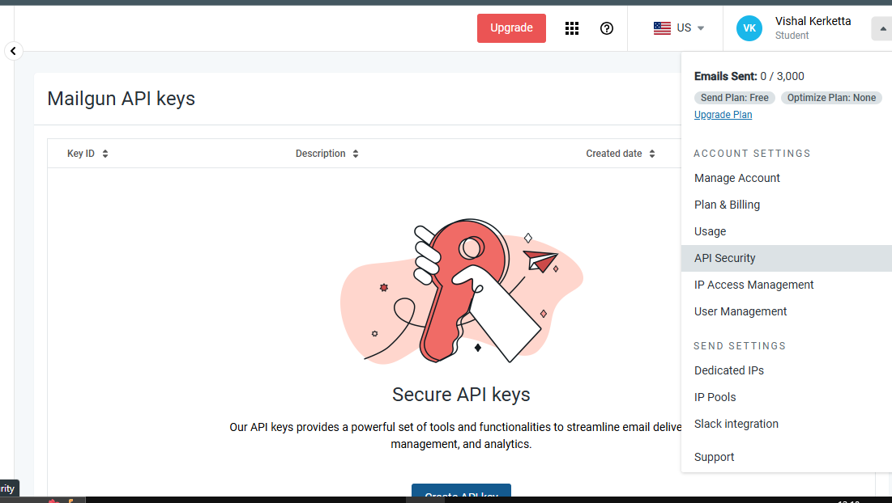
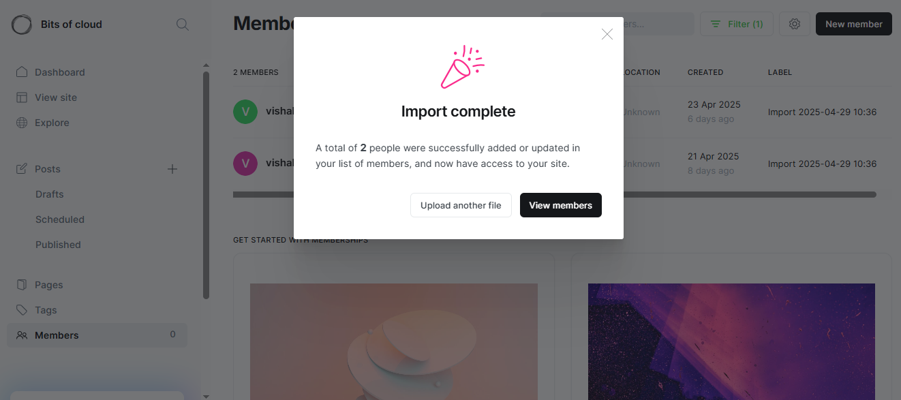

### Introduction

**Note**: You need an active aws account.


### 1. Launch Amazon lightsail
- Login to you aws account and navigate to [Amazon Lightsail](https://lightsail.aws.amazon.com/)

- Select Platform as "Linux" and choose "Ghost"
    

- Leave all the fields as default and procced further, you can change Instance name and add tags.

- Scroll bottom and click on Create instance button.

- Click on the name of instance and it will show all the information (IP, AWS region etc).
    

- Copy you public IP and paste it in Browser URL and our website is live.
    


**Note:If you want to deploy Ghost on EC2, follow [docs](https://ghost.org/docs/install/)**


### 2. Login and change Username and Password
#### Get Initial Username and Password
- Go to Lightsail tab and in you will find an option/button connect using SSH. Click on that.
- It will open a terminal window, type command `cat bitnami_credentials`, it will give Username and password
    

#### Login
- Go in the browser URL bar type `<YOUR_IP>/ghost`
    

- Enter Username and Password Copied Earlier and Login.

#### Change Username and Password

- Click on User profile and change Username(Email) and Password
    


### 3. Let's Explore Some Settings
#### Customize HomePage and theme
- Navigate to dashboard then Customize your design, and upload logo, background image, you can change font etc. 
    
- Add about-me page
    - Go to pages and click New Page
         
    - Write about you and click on publish page, then see it via browser, copy the link of that page.
    - By default ghost gives a About page, to add our created page to to settings/navigation
        
    - then click on customize and add the link of your about page in there.
        

- You can change or customize theme by navigating to settings/theme
    

#### Email
Now we'll configure ghost to send emails from our domain name via Mailgun.

- [Create a free account in m@ailgun](https://app.mailgun.com/)
- Add your domain in mailgun 
- it will ask to Install and verify all DNS records (TXT : sending reconrd,MX : receiving records, CNAME : tracking records ) that it will list 
    
- Add DNS records in your Domain registrar portal and then come back to Mailgun and click verify, after sucessfull you will get a mail that you domain is now verified.
    


- Bulk mail send mail to bulk users like sending new publication, Newsletter and transactional email is sent to individuals, for example reset passeord.

- Configuring ghost to send bulk email
    - go to you mailgun dashboard the click on your profile and then API security and click on Add New Key.
    
    - Give a description and create
    
    - got to settings/mailgun 
    - click on edit: Select region, add you domain and add API key.
    

- Configuring ghost to send transactional mail.
    - Go to mailgun, click on Send then Domain setting and click on your newly added domain then go to `SMTP credentials` click on `Add new SMTP user`
    

    - We can add configuration in two ways:
        1. edit `config.production.json` file, located in /var/www/ghost in AWS lightsail it is located at /opt/bitnami/ghost/config.production.json
            ```bash
            "mail": {
                "transport": "SMTP",
                "options": {
                    "service": "Mailgun",
                    "host": "smtp.eu.mailgun.org",
                    "port": "587",
                    "secure": true,
                    "auth": {
                    "user": "noreply@bitsofcloud.joakim.onlin",
                    "pass": "your_password"  # add your smtp user password here
                    }
                }
            }
                            ```
        2. by environment variables (for running in EKS add credentials in secret which can be then accessed by pod as environment variable).
            ```bash
            # Mail (SMTP) configuration using Mailgun
            - name: mail__transport
              value: "SMTP"
            - name: mail__options__service
              value: "Mailgun"
            - name: mail__options__auth__user
              value: noreply@bitsofcloud.joakim.online
            - name: mail__options__auth__pass
              value: <Your SMTP user password>
            ```
- Subscribe from any mail and write a blog.
- While publish click on publish and send.
    

- Check your mail and you see you get the email from the custom domain.
    


**Learning:**
before setting users didn't had option to reset the passwrod, even if root tries to login from another browser ghost wants to send a confirmation mail, it if you try it before setting up mail it will say magic link fail, but after setting up mail it will work fine


#### Import Subscribers
- We have a CSV file containing information about our beehiiv newsletter suberscribers.
- To import subscribers in ghost go to /ghost/members and click on settings button on top and then Import members.
    
- then upload the CSV file and import
    
    

#### Import Content
- When we exported content from beehiiv we got a CSV file, but ghost expects a JSON or Zip file.
- Using `Migrate` (a tool to import content)
    - Install [Migrate](https://github.com/TryGhost/migrate)
        ```bash
        # Run following commands:
        # install npm if not installed

        npm install --global @tryghost/migrate

        npm install @tryghost/mg-beehiiv --save

        which migrate  # /usr/local/bin/migrate

        #go to that patt (/usr/local/bin/migrate) and run command
        
        migrate beehiiv --posts ./posts.csv --url https://cloud.joakim.online --scrape all --verbose ture --no-log

        # it wiil create a zip file
        ```
    - ```bash
        #Upload that zip file in aws S3 bucket 

        aws s3api create-bucket \
            --bucket ghost-cms-bucket-82b723 \
            --region ap-south-1 \
            --create-bucket-configuration LocationConstraint=ap-south-1


        aws s3 cp /path/to/your/file.zip s3://ghost-cms-bucket-82b723/

        # Choose a uniqe bucket name
        ```
    - Go to Import and choose Universal Migration and upload Zip file (download from S3)
        
    - Go to posts and you will see the posts that were written on beehiiv are now imported.
        


---
[Home Page](README.md)
